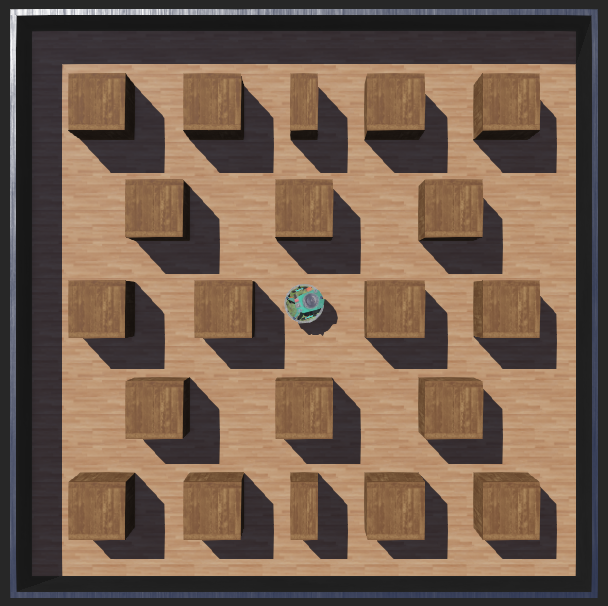

# Projeto de Robótica

### Integrantes
Livia Lumi Miyabara – 22.122.045-2  
Thiago Garcia Santana – 22.122.003-1  
Márcio Forner Nepomuceno de Almeida – 22.122.040-3  

Este projeto foi desenvolvido usando a plataforma Webots, e tem como objetivo fazer um robô e-puck percorrer um mundo que possuí 20 caixas, encontrando a caixa de menor peso. Ao encontrar a caixa mais leve, ele deve parar de percorrer o mundo e rodar em volta de si mesmo

# Lógica utilizada

Para movimentar o robô seguimos a seguinte lógica:

- Caso a flag de "EncontrouCaixaLeve" tenha sido acionada, o robô ficará girando para esquerda
- Caso os sensores 7, 0 ou 1 detectem um valor maior que 1000 e os sensores 2 ou 3 também, o robô irá virar para a esquerda
- Caso os sensores 7, 0 ou 6 detectem um valor maior que 1000 e os sensores 4 ou 5 também, o robô irá virar para a direita
- Caso os sensores 7 ou 0 detectem um valor maior que 1000, o robô irá virar para a direita
- Caso nenhuma das condições acima tenha sido atendida, o robô irá andar para a frente

Para localizar a caixa mais leve, obtemos a posição de todas as caixas nos eixos x, y e z e armazenamos em uma matriz bidimensional
Após a movimentação o robô fazemos a mesma análise novamente para comparar a posição de cada caixa antes do movimento do robô com a posição de cada caixa após o movimento do robô. Caso uma das caixas tenha se movimentado no mínimo 0.001 m em qualquer um dos eixos, ativamos a flag "EncontrouCaixaLeve"

# Assista à simulação!
